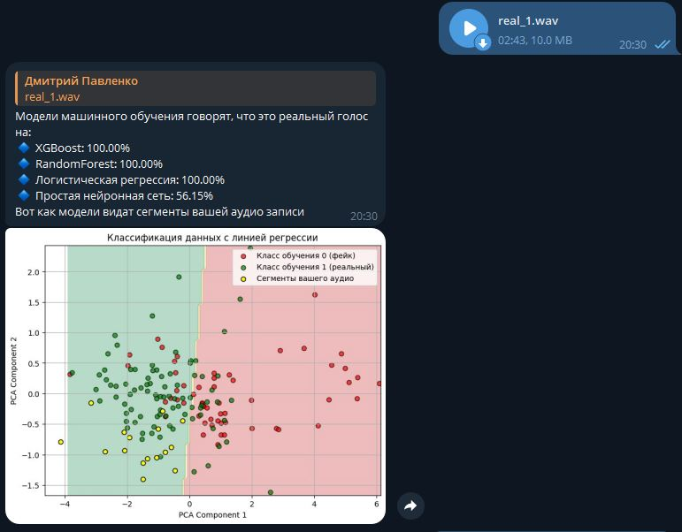

# FakeVoiceDetector

# 🔍 Voice Authenticity Classifier  
**Классификация реального и синтетического голоса**  

Этот проект посвящен **распознаванию синтетического голоса**, созданного нейросетями, и отличению его от реального человеческого.  
В ходе работы было обучено несколько моделей, и лучшая из них достигла **точности 86%**.  

##  Технологии и модели  
 **Обученные модели:**  
-  **XGBoost** – **86%** (лучший результат)  
-  **RandomForest** – **74%**  
-  **Логистическая регрессия** – **72%**  
-  **Простая нейросеть** (несколько слоев) – **79%**  

Если бот активен его можно найти по ссылке
t.me/test_fake_voice_detector_bot

Модели и датасет можно скачать по ссылке
https://drive.google.com/file/d/1Chh9nVN23iXOttaiegAzapa3rI-9EtRh/view?usp=sharing
